# hourglass.js

## Table of Contents

### Async

- until
- inspectable 🚧
- retry 🚧
- delay (with jitter) 🚧
- cancelable 🚧
- lazy 🚧
- promisify 🚧
- eta 🚧
- speedBump 🚧
- timeWindow 🚧
- frequency 🚧
- ? mutex 🚧
- timeout 🚧
- concurrent 🚧
- backoff 🚧
- slowStart 🚧
    - inverted backoff
- promiseWithResolvers
  - polyfill from TC39 proposal

<!-- ### Iterables (Generators, Arrays, ...) -->
<!---->
<!-- - distinct 🚧 -->
<!--   - use hash as key -->
<!--   - must be serializable -->
<!-- - tee 🚧 -->
<!-- - delay 🚧 -->
<!-- - observe 🚧 -->
<!-- - playback 🚧 -->
<!-- - tap 🚧 -->
<!-- - roundRobin 🚧 -->
<!--     - interleave https://more-itertools.readthedocs.io/en/stable/api.html#more_itertools.interleave -->
<!-- - unique (distinct) 🚧 -->
<!-- - zip 🚧 -->
<!-- - collect 🚧 -->
<!-- - observe 🚧 -->
<!-- - drop -->
<!-- - dropWhile -->
<!-- - takeWhile -->
<!-- - chunk -->
<!-- - count -->
<!-- - slidingWindow -->
<!--     - https://more-itertools.readthedocs.io/en/stable/api.html#more_itertools.sliding_window -->
<!-- - distribute -->
<!--     - https://more-itertools.readthedocs.io/en/stable/api.html#more_itertools.distribute -->
<!--     - distribute into other generators -->
<!-- - padStart -->
<!-- - padEnd -->
<!-- - unique -->
<!-- - flatten -->
<!-- - min -->
<!-- - max -->
<!-- - first -->
<!-- - last -->
<!-- - nth -->
<!-- - sieve -->


### Async Iterables (Streams, Web Streams, Async Generators, ...)

- intoAsyncGenerator 🚧
- distinct 🚧
    - accepts a serializer argument
- filter 🚧
- map 🚧
- reduce 🚧
- delay 🚧
- remember 🚧
- pipe 🚧
- some 🚧
- find 🚧
- every 🚧
- flatMap 🚧
- drop
- dropWhile
- take
- enumerate
- item 🚧
- last 🚧
- roundRobin 🚧
- unique 🚧
- zip
- collect 🚧
- first 🚧
- throttle 🚧
- debounce 🚧
- merge 🚧

## Async

### `until`

Returns a promise that is resolved once the `predicate` function returns a truthy value, or is rejected if `predicate` don't reuturn a truthy value before `timeout`.

#### Arguments

- `predicate: () => boolean`
- `options`
    - `options.timeout: number`
    - `options.interval: number`

#### Returns

`Promise<void>`

#### Example

```js
async function isElementMounted() {

}

await until(isElementMounted)

```
#### `merge`

```mermaid
flowchart LR
    s1[a] -.-
    a1("🔴") ---->
    b1("🟠") --->
    c1("🟡") -.->
    end1["🏁"]

    s2[b] -..-
    a2("🟢") -->
    b2("🔵") --->
    c2("🟣") -..->
    end2["🏁"]

    s3["merge(a, b)"] -.-
    a3("🔴") -->
    b3("🟢") -->
    c3("🔵") -->
    d3("🟠") -->
    e3("🟣") -->
    f3("🟡") -.->
    end3["🏁"]
```



Example:

```js
const merged = merge(a, b)
await collect(merged) // => ['🔴', '🟢', '🔵', '🟠', '🟣', '🟡']
```

#### `zip`

```mermaid
flowchart LR
    s1[a] -.- a1
    a1("🔴") ----> b1("🟠")
    b1 ---> c1("🟡")
    c1 -.-> d1["🏁"]

    s2[b] -..- a2
    a2("🟢") --> b2("🔵")
    b2 ---> c2("🟣")
    c2 -.-> d2["🏁"]

    s3["zip(a, b)"] -..- a3
    a3("🔴 🟢") ---> b3("🔵 🟠")
    b3("🔵 🟠") ---> c3("🟣 🟡")
    c3 -.-> d3["🏁"]

```



#### `take`

```mermaid
flowchart LR
    s1[a] -.- a1
    a1("🔴") --> b1("🟠")
    b1 --> c1("🟡")
    c1 --> d1("🟢")
    d1 --> e1("🔵")
    e1 --> f1("🟣")
    f1 -.-> g1["🏁"]

    start3["take(3, a)"] -.- a3
    a3("🔴") --> b3("🟠")
    b3 --> c3("🟡") -.-> end3["🏁"]

```



#### `skip(n: number, gen: AsyncGenerator): AsyncGenerator`

```mermaid
flowchart LR
    s1[a] -.- a1
    a1("🔴") --> b1("🟠")
    b1 --> c1("🟡")
    c1 --> d1("🟢")
    d1 --> e1("🔵")
    e1 --> f1("🟣")
    f1 -.-> g1["🏁"]

    start3["skip(2, a)"] -...-
    a3("🟡") -->
    b3("🟢") -->
    c3("🔵") -->
    d3("🟣") -.->
    end3["🏁"]
```



#### `chain`

```mermaid
flowchart LR
    s1[a] -.-
    a1("🔴") -->
    b1("🟠") -->
    c1("🟡") -.->
    end1["🏁"]

    s2[b] -.-
    a2("🟢") -->
    b2("🔵") -->
    c2("🟣") -.->
    end2["🏁"]

    s3["chain(a, b)"] -.-
    a3("🔴") -->
    b3("🟠") -->
    c3("🟡") -->
    d3("🟢") -->
    e3("🔵") -->
    f3("🟣") -.->
    end3["🏁"]
```



#### `forward`

#### `inspect`

#### `inspectCatch`

#### `collect`

#### `reduce`

```mermaid
flowchart LR
    start1[a] -.- a1
    a1("🥖") -->
    b1("🥩") -->
    c1("🥬") -->
    d1("🍅") -->
    e1("🧀") -.->
    end1["🏁"]

    start2["reduce"] -......- a3
    a3("🍔") -.->
    end3["🏁"]

```

<!-- 🥖 🥩 🥬 🍅 🧀 ? 🍔 : 🙅‍♀️ -->



#### `buffered`

#### `chunks`

### Streams

#### `remember`

<!-- Reference: https://github.com/staltz/xstream#-remember -->

#### `pipe`

```js
const pipeline = pipe(
    gen => filter(x => x % 2 === 0, gen),
    gen => map(x => x * 2, gen)
)
await collect(pipeline(integers)) // => [2, 6, 10, 14]
```

## Reference
- https://docs.rs/futures/0.1.31/futures/stream/trait.Stream.html#method.zip

Design reference
- https://medium.com/@jshvarts/read-marble-diagrams-like-a-pro-3d72934d3ef5
